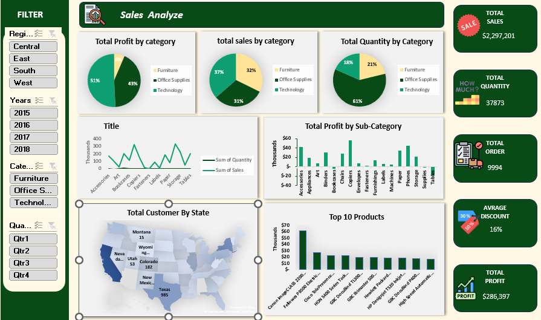

# 📊 Sales Analyze Dashboard

لوحة تحكم تفاعلية (Interactive Dashboard) لتحليل بيانات المبيعات، تم تصميمها باستخدام **Power BI**، وتهدف إلى تقديم رؤية شاملة وسريعة عن أداء المبيعات، الأرباح، الكميات، والعملاء.

---

## 🎯 نظرة عامة

تعرض هذه اللوحة أهم مؤشرات الأداء (KPIs) الخاصة بالمبيعات، مع إمكانية الفلترة حسب المنطقة، السنة، الفئة، والربع السنوي، لتسهيل استكشاف البيانات واتخاذ القرارات بناءً عليها.

---

## 🧩 المكونات الرئيسية

### 🔍 الفلاتر (Filters)
- **Region**: Central, East, South, West
- **Years**: 2015, 2016, 2017, 2018
- **Category**: Furniture, Office Supplies, Technology
- **Quarter**: Qtr1, Qtr2, Qtr3, Qtr4

### 📈 المؤشرات الرئيسية (KPIs)
| المؤشر | القيمة |
|---|---|
| إجمالي المبيعات (Total Sales) | $2,297,201 |
| إجمالي الكمية (Total Quantity) | 37,873 |
| إجمالي الطلبات (Total Order) | 9,994 |
| متوسط الخصم (Average Discount) | 16% |
| إجمالي الربح (Total Profit) | $286,397 |

### 📊 الرسوم البيانية (Visuals)
- **Total Profit by Category** – توزيع الأرباح حسب الفئة (Pie Chart)
- **Total Sales by Category** – توزيع المبيعات حسب الفئة (Pie Chart)
- **Total Quantity by Category** – توزيع الكميات حسب الفئة (Pie Chart)
- **Sum of Quantity & Sales (Trend)** – خط زمني لتتبع الكمية والمبيعات عبر الفئات الفرعية
- **Total Profit by Sub-Category** – الأرباح والخسائر لكل فئة فرعية (Bar Chart)
- **Total Customer by State** – توزيع العملاء جغرافيًا على خريطة الولايات المتحدة
- **Top 10 Products** – أعلى 10 منتجات من حيث المبيعات (Bar Chart)

---

## 🛠️ الأدوات المستخدمة
- **Power BI Desktop** لإنشاء وتصميم اللوحة
- مصدر البيانات: ملف مبيعات (Excel / CSV) يحتوي على بيانات الطلبات، المنتجات، العملاء، والمناطق

---

## 🚀 كيفية الاستخدام
1. افتح ملف `.pbix` باستخدام Power BI Desktop.
2. استخدم الفلاتر الجانبية لتحديد المنطقة، السنة، الفئة، أو الربع السنوي المطلوب.
3. تفاعل مع الرسوم البيانية للتعمق في تفاصيل كل قسم.

---

## 📌 ملاحظات
- جميع القيم المعروضة في هذه اللوحة هي بيانات تجريبية (Sample Data) لأغراض التحليل والعرض.
- يمكن تعديل مصدر البيانات لربط اللوحة ببيانات مبيعات حقيقية.

---

## 👤 المطوّر
تم تصميم هذا المشروع كجزء من أعمال تحليل البيانات وتصور المعلومات (Data Visualization).
